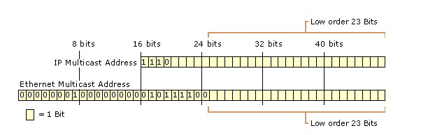

## 实战检验

> 编写一个广播程序，将本机的时间发送给网络中的所有主机。

服务端：[tserv](tserv.c)，执行命令：`./tserv 127.0.0.1 1234`

客户端：[tcli](tcli.c)，执行命令：`./tcli 1234`

> 编写一个多播程序，将本机的时间发送给网络中的两台主机。

服务端：[mtserv](mtserv.c)，执行命令：`./tserv 224.0.2.3 1234`

客户端：[mtcli](mtcli.c)，执行命令：`./tcli 224.0.2.3 1234`

## 上机实战

> 请使用多播技术写一个多人聊天室程序。


## 课堂笔记

- 广播和多播要使用UDP，二者都不能使用TCP。（TCP点对点通信）
- 广播的作用：1.资源定位 2.实现一对多通信。
- sendto只能向非广播地址发送数据报，如果要发送广播数据报，必须要告诉内核，可以通过设置
`SO_BROADCAST`套接口选项来做到这一点。

```cpp
int on = 1;
setsockopt(sockfd, SOL_SOCKET, SO_BROADCAST, &on, sizeof(int));
```

- 广播地址标识子网上的所有接口，多播地址标识一组接口。广播局限于局域网，多播既可用于局域网
也可**跨越广域网**。

- 多播是单播和广播的**折衷**。

- 多播是通过D类地址进行的，D类地址的前4位为`1110`，后面**28**位为多播的组标识。

- 当一个多播分组到达一个以太网时，形成帧后它的MAC地址为`01:00:5e:xx:xx:xx`。其后23位由
多播组标识的后23位映射而成的。（28-23=5位被忽略，故造成了地址映射不唯一的情况。）



- 网卡可能接收相同MAC地址的多播数据帧（实际是不同的多播组），此时IP层发现不是本组的多播分组后
将其丢弃。

- 当加入或离开一个组时，要用到下面两个结构：

```cpp
struct ip_mreq{
  struct in_addr imr_multiaddr; //IPv4的D类多播地址
  struct in_addr interface; //本地接口IPv4地址
}

struct ipv6_mreq{
  struct in6_addr ipv6mr_multiaddr;
  unsigned int ipv6mr_interface;
}
```
